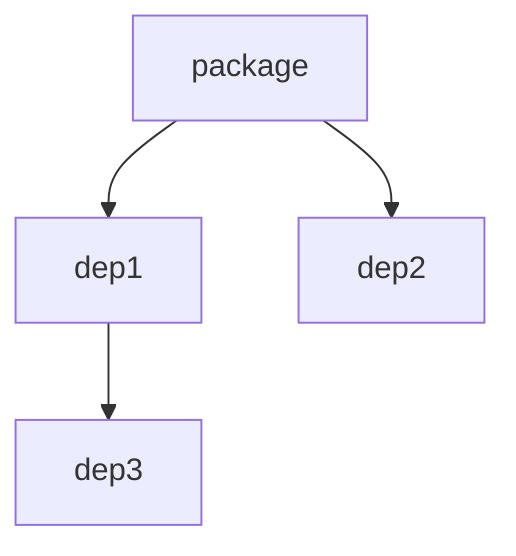

# Инструмент для визуализации графа зависимостей

Этот инструмент предоставляет интерфейс командной строки для визуализации графа зависимостей Python-пакета, включая транзитивные зависимости. Он генерирует граф в формате Mermaid и сохраняет его в виде PNG-файла.

## Возможности

- **Рекурсивный анализ зависимостей:** Получает все прямые и транзитивные зависимости Python-пакета.
- **Генерация графа Mermaid:** Создает текстовое представление графа зависимостей в формате Mermaid.
- **Рендеринг графа:** Использует внешний рендерер Mermaid (например, `mmdc`) для генерации изображения в формате PNG.
- **Обработка ошибок:** Предоставляет информативные сообщения об ошибках для недействительных пакетов или проблем с рендерингом.
- **Покрытие тестами:** Включает модульные тесты для основных функций.


### Предварительные требования

1. Установите рендерер Mermaid CLI (`mmdc`):
   ```bash
   npm install -g @mermaid-js/mermaid-cli
   ```

2. Убедитесь, что `pip` установлен и настроен.

## Использование

Запустите скрипт с использованием следующих аргументов:

```bash
python main.py --path_to_renderer <path_to_renderer> \
               --package_name <package_name> \
               --output_path <output_path>
```

### Аргументы

- `--path_to_renderer`: Путь к рендереру Mermaid (например, `mmdc`).
- `--package_name`: Имя Python-пакета для анализа.
- `--output_path`: Путь для сохранения PNG-файла с графом.

### Пример

```bash
python main.py --path_to_renderer /usr/local/bin/mmdc \
               --package_name requests \
               --output_path dependencies.png
```

## Вывод

- PNG-файл (`dependencies.png`), содержащий визуализированный граф зависимостей.

### Пример графа

Ниже представлен пример графа Mermaid для гипотетического пакета:



## Тестирование

Запустите модульные тесты с помощью `unittest`:

```bash
python -m unittest main.py
```

### Покрытие тестов

- **Получение зависимостей:** Проверяет корректность извлечения и обработки зависимостей.
- **Генерация графа Mermaid:** Проверяет, что формат графа соответствует ожидаемому.

## Пример работы


Вы можете улучшить инструмент, добавив новые функции или изменив стиль графа!

