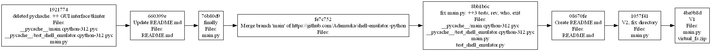
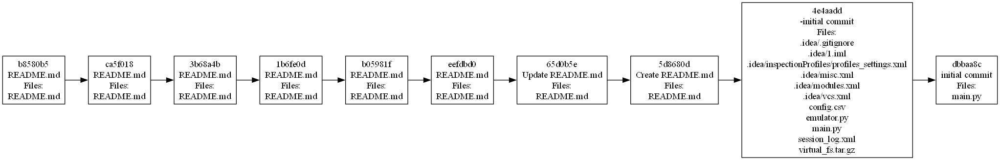

## README

Эта инструмент командной строки для визуализации графа 
зависимостей, включая транзитивные зависимости. Сторонние средства для 
получения зависимостей использовать нельзя.

Зависимости определяются для git-репозитория. Для описания графа 
зависимостей используется представление Graphviz. Визуализатор 
выводит результат в виде сообщения об успешном выполнении и сохранять граф 
в файле формата png

## Запуск
Для запуска программы ввод py main.py <cсылку на гитхаб>

## Тестирование
Для проверки было использованно 2 репозитория:

1. https://github.com/Wertais/1.git
2. https://github.com/Wertais/2.git

Граф зависимостей 1 репозитория:

Граф зависимостей 2 репозитория:

Построенные графы соответствуют дейтсивтельности.
